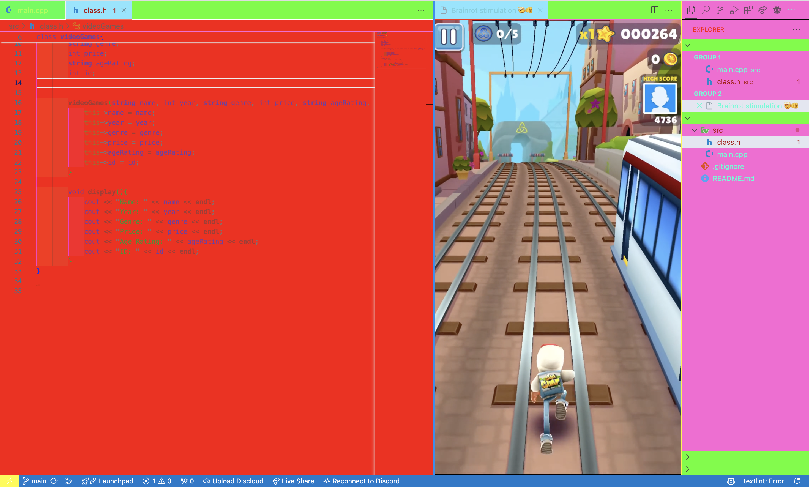

# dataManagementTreeCPP

- Work in team of two!

- Build a data management solution, similar to the first exercise, based on BSTs (Binary Search Trees)!

  - You can use an auxiliary data structure too...

- Supported Actions: Search/Retrieval, Insertion, Deletion

- The tree should be self-balancing!
  - what data should you store inside it?

## How to run

First of all, you'll need to clone the repository by clicking on the green button on the top right of the repository then download the .zip file and extract it.

After that, you can navigate to the folder where you extracted the files and open a terminal in that folder.

To run the program you need to have the `g++` compiler installed on your machine. If you don't have it, you can install it by running the following command:

```bash
sudo apt install g++
```

After that, you can run the following command to compile the program:

```bash
g++ -o main main.cpp
```

And to run the program, you can run the following command:

```bash
./main
```

## Important Notes

You should know that the coding was made under these conditions:


(We like to suffer)
